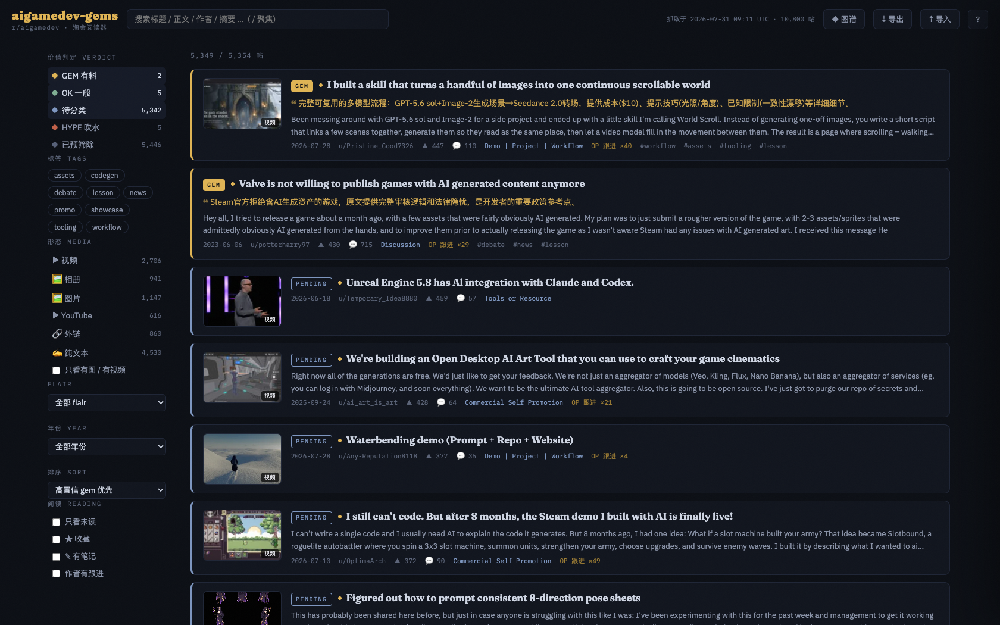

# aigamedev-gems — r/aigamedev 淘金阅读器

Find the signal in [r/aigamedev](https://www.reddit.com/r/aigamedev/): a full archive
of the subreddit, LLM-classified to separate reusable substance (**gem**) from
promotion and noise (**hype**), with the media embedded inline — this sub is mostly
people *showing* things — full comment threads, a reading-focused browser on GitHub
Pages, and a local research pipeline for deep analysis with `claude -p`.

**Live site**: https://hoveychen.github.io/aigamedev-gems/



**10,800** posts archived (2022-12 → 2026-07-31) · **85,676** comments ·
**5,354** prefilter candidates · LLM-classified so far: **2 gem** / 5 ok / 5 hype
(a 12-post pilot batch — everything else sits as `pending` until the next local run)

## How it works

```
Arctic Shift API ──► scrape.py ──► posts.jsonl + comments.jsonl
                                        │
                              prefilter.py (heuristics: body length,
                              author follow-up, engagement, media, flair)
                                        │
                              classify.py  ← LOCAL ONLY, claude -p
                              (gem / ok / hype + tags + 中文摘要)
                                        │
                              build_data.py ──► data.json + threads/*.json
                                        │
                 ┌──────────────────────┴──────────────────┐
            index.html (GitHub Pages)               dump.py (LOCAL)
            阅读器 + 媒体内嵌 + 笔记 + 图谱          research/*.md → claude -p
```

- **GitHub Actions** (`update.yml`) re-scrapes daily and refreshes `data.json` +
  `threads/`. New posts appear as `pending` until the next local classify run.
- **Classification runs locally** (uses your Claude subscription, no API key in CI):

  ```bash
  python3 scrape.py && python3 prefilter.py     # refresh raw data
  python3 classify.py --model haiku              # claude -p, resumable
  git add classifications.jsonl && git commit -m "classify batch" && git push
  ```

  `classify.py` walks candidates highest-engagement-first and is resumable, so
  `--limit 600` spends a fixed budget on the posts most likely to be worth it and
  leaves the rest visible as `pending`.

- **Notes live in your browser** (localStorage): reading states, stars, per-post
  notes with `[[wiki-links]]`, concept notes. The knowledge-graph view grows from
  the `[[links]]` you write. Use ⇣ 导出 / ⇡ 导入 to back up or move devices.

- **Local deep research**:

  ```bash
  python3 dump.py --status gem --tags workflow assets
  claude -p "Read research/*.md and synthesize the AI-assisted gamedev pipelines \
  that actually shipped, and where they broke." --add-dir research
  ```

## What makes this different from the sibling archives

This is the third of a family ([reddit-gems](https://github.com/hoveychen/reddit-gems),
[ai-trading-gems](https://github.com/hoveychen/ai-trading-gems)), and r/aigamedev
forced two real changes rather than a rename:

1. **The media *is* the content.** Half the archive — 5,410 posts — is video (2,706),
   image (1,147), gallery (941) or YouTube (616), another 860 are external links, and
   43% of all posts carry no body text at all. So the reader embeds
   v.redd.it video (HLS with mp4 fallback), gallery carousels, images and YouTube
   inline, list rows carry a still, and a post with an empty body but a playable
   demo and a live thread is treated as substance, not emptiness.
2. **Flair is a signal, not a verdict.** The sub *requires* the
   `Commercial Self Promotion` flair on any post about your own project, so 19% of
   the archive wears it — including solo devs writing up exactly the process this
   reader exists to surface. An early rule that killed promo-flaired posts threw
   away a 250-Claude-iteration post-mortem and an open-source voxel-game writeup, so
   flair now only costs a post the media shortcut. The LLM makes the call, and it is
   told explicitly that it cannot see the video and should judge from the thread.

## Files

| File | Purpose |
|---|---|
| `index.html` | Single-file reader (no build step) — filters, media embeds, threads, notes, graph |
| `data.json` | Post index: status, tags, 中文摘要, media fields, signals |
| `filtered.json` | Prefilter-rejected posts (lazy-loaded), media fields kept so they stay browsable |
| `threads/<id>.json` | Full nested comment tree per prefilter-passed post |
| `scrape.py` | Posts + comments full-history scrape (resumable cursors) |
| `prefilter.py` | Heuristic candidate filter → `candidates.jsonl` |
| `classify.py` | Local `claude -p` batch classification → `classifications.jsonl` |
| `build_data.py` | Builds `data.json` + `filtered.json` + `threads/` |
| `shots.py` | Renders `media/<id>.jpg` — a 2×2 contact sheet of video frames / gallery images so a model can *see* the post |
| `media/<id>.jpg` | Pre-rendered still per media post (committed; survives Reddit's per-video blocking) |
| `dump.py` | Markdown research bundles + their stills → `research/` (gitignored) |
| `serve.sh` | Local launch (`./serve.sh`, needs HTTP for `fetch`) |

> `posts.jsonl` / `comments.jsonl` (the raw archive) are not committed — run
> `python3 scrape.py` to regenerate them.

## Hand one post to an agent

There is no server to run. The refresh job is a GitHub Action and everything it
produces is a static file, so **the file layout is the API** — the same paths resolve
on disk and over HTTPS.

| Endpoint | What it is |
|---|---|
| `data.json` | The index — every candidate post with status, tags, 中文摘要, media fields |
| `threads/<id>.json` | **One post, self-contained**: verdict, tags, summary, flair, score, raw body, media (incl. `still`), prefilter signals, and the full nested comment tree |
| `media/<id>.jpg` | A still the model can look at: 4 video frames tiled 2×2, or the gallery's images, or the image at full width |
| `filtered.json` | Prefilter-rejected posts (index only, no thread file) |

```bash
# local
cat threads/1uh94v8.json | jq '{title, status, tags, summary_zh, media, n: (.comments|length)}'

# or straight off Pages, no clone needed
curl -s https://hoveychen.github.io/aigamedev-gems/threads/1uh94v8.json | jq .title
curl -sO https://hoveychen.github.io/aigamedev-gems/media/1uh94v8.jpg
```

`threads/<id>.json` is deliberately the *whole* post — one fetch, no joins against
`data.json` — because the point is to drop a single post into an agent's context and
ask about the project inside it.

To hand a set of posts to `claude -p` as markdown plus images:

```bash
python3 dump.py --ids 1uh94v8 1uomio3        # → research/<date>-<id>-<slug>.{md,jpg}
claude -p "For each post in research/, tell me what the project actually is, which \
models/tools it used, and whether the method is reproducible. Look at the contact \
sheet images." --add-dir research
```

`dump.py` copies each post's still next to its markdown and links it inline, so the
model reads the thread and looks at the artifact in the same pass. `--status gem`,
`--tags workflow assets`, `--since`, `--min-score` all still work for bulk selection.

## Run locally

```bash
./serve.sh        # http://localhost:8000
```

## Verdict guide

| Status | Meaning |
|---|---|
| `gem` | Concrete reusable substance: a pipeline you could follow, tool/model specifics, an honest post-mortem, genuinely informative analysis |
| `ok` | A real artifact or real information, but the method isn't transparent (the typical showcase demo), or the discussion is opinion-only |
| `hype` | Promotion, content-free bragging, engagement bait, low-effort output dumps |
| `pending` | Passed the prefilter, awaiting the next local classify run |
| `filtered` | Dropped by the heuristic prefilter — still listed and still browsable (media included) |

Tags: `workflow` `assets` `codegen` `npc-ai` `showcase` `tooling` `lesson`
`debate` `question` `news` `promo`

## Known limitations

- **Some videos won't play.** Reddit restricts a slice of v.redd.it outright: for
  those, both the HLS segments and the fallback mp4 return 403 regardless of token
  or referer. Measured on 40 sampled archived videos: 36 played, 4 were blocked
  (~90% playable). Blocked ones fall back to a still plus a link to the original
  post instead of a dead player.
- **Not every media post kept its media.** Arctic Shift preserved a playable URL for
  2,052 of 2,706 video posts (75%) and the full image list for 542 of 941 galleries
  (57%, averaging 4.4 images). The rest show their still — 66% of all posts have
  one — and link out.
- **Comment archives are not complete.** Arctic Shift captures a large share but not
  every reply of a big thread (a 715-comment post archives ~810 nodes across
  nesting, older threads noticeably fewer), so counts in the reader can sit below
  Reddit's own number.
- **Media loads from Reddit's CDN**, so the page needs network access; images,
  galleries and thumbnails all serve fine today, but archived URLs are not
  guaranteed forever.

## Data source & license

Post and comment metadata come from the public
[Arctic Shift](https://arctic-shift.photon-reddit.com/) API. All content is the
property of its respective authors / Reddit; this repository is for research and
archival purposes only.
